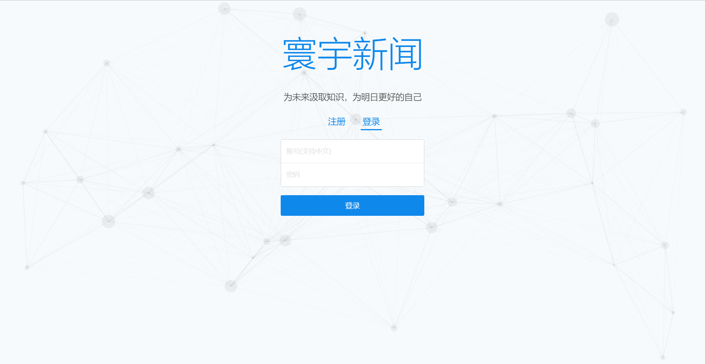
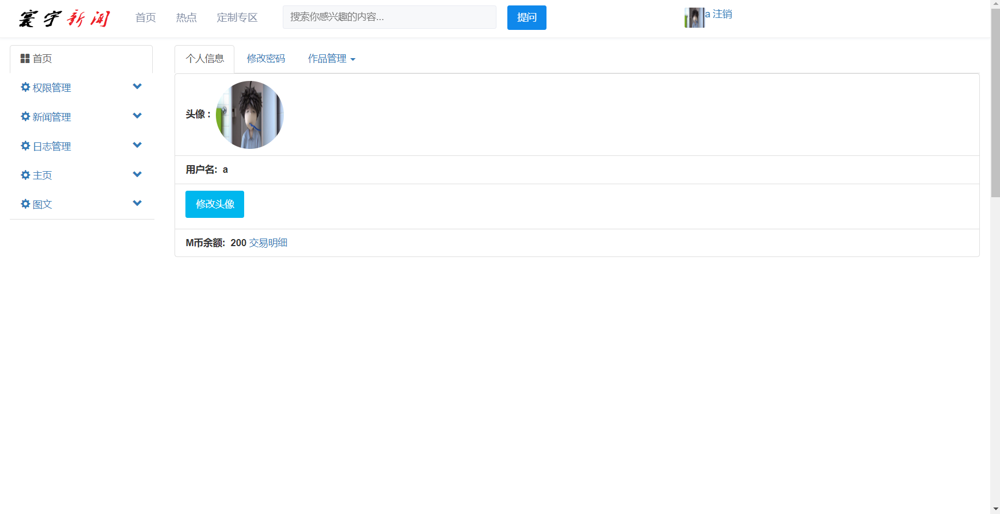
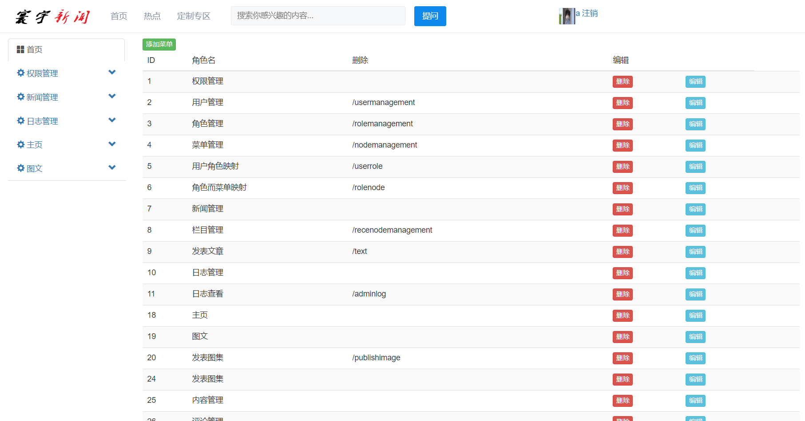
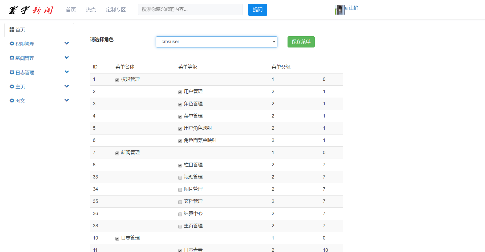
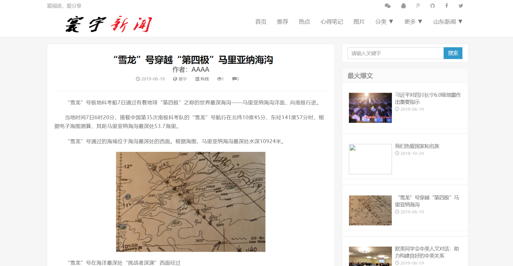

# 寰宇新闻--HuanYuNews

**寰宇新闻是一个仿今日头条的Web端项目。使用SpringBoot+Mybatis+thymeleaf开发。前端使用bootstrap、html5、css3动画、jQuery、WangEditor富文本编辑器、Webuoloader和Base64处理图片上传、ajax异步处理表单数据,包括后台管理系统。**

## 系统模块

系统功能模块组成如下所示

```
├─管理端
   │  ├─权限管理
   │  ├─新闻管理
   │  ├─日志管理
   │  └─素材管理
├─用户端
   |  ├─首页
   |  ├─新闻展示
   |  ├─新闻推荐
```

## 运行环境

- jdk8
- tomcat8.5
- mysql5.6+
- IntelliJ IDEA
- Maven
- redis

## 项目技术

- spring boot
- spring mvc
- mybatis
- bootstrap
- jquery
- redis

## 项目资源

**数据库文件：** 

链接：https://pan.baidu.com/s/1YtG3Xvg-uf2UWp2IVW-hOg
提取码：h3d2


## 小组成员

- 刘思杉 github: [liusishan](https://github.com/) 学号: 201725230545
- 孙菁 github: sunjing0701 学号: 201725230502
- 薄常峰 github:bbbbbb123456 学号:201725230525
- 张海龙 github:q1322021151 学号:201725230520
- 张旭 github:786127827 学号:201725230547
- 王庆东  github:puppeteer8    学号:201725230509
- 王玉玲   github:1752301441    学号:201725230518


**注意：使用时，需下载配置redis环境**

## 系统截图













# 更新日志

**欢迎大家踊跃提出自己对该系统的任何想法和建议！**

| 版本   | 日期       | 特性                                      |
| ------ | ---------- | ----------------------------------------- |
| V1.0.0 | 2019/06/28 | 规整README.md说明文档，使之更加易懂理解。 |
| V1.0.1 | 开发中     |                                           |